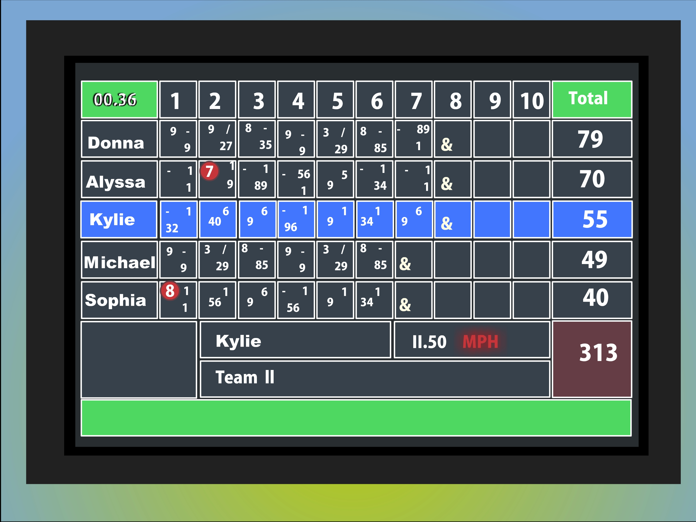

Sites and forums such as StackOverflow have become extremly important to the global network of programmers and developers. If you ever get stuck trying to make an algoritm or trhoubleshoot a function, StackOverflow will either have the answer, or someone who can amswer your question. However, as anyone who has asked a question on the site should know, if you don't put any work into your question, your question will be ridiculed, locked, and downvoted into oblivion. Luckily, as long as you put some effort into googling your issue and writing your question in an informed way, you can get high-quality help. 

To provide an example of a poorly worderd question, we have this one [here](https://stackoverflow.com/questions/26439695/10-pin-bowling-score-calculator-in-javascript) by user "enigma coder". Their post is very short, so I'll quote it in its entierty here:
>I have been tasked with creating a bowling score calculator in javascript.
>I am a complete newbie to javascript so I'm not sure where to start. Are there any simple examples of this specific project I can use as reference?
>I keep finding long and convoluted code for it that doesn't make much sense...

This post makes it very obvious that the poster did some work in the form of searching for a full code answer, but did not include any of the examples that they found that confused them. They also did not provide any of the specifics that this project required of them such as wether there needs to be a UI, or even how the data for the scores should be stored. This lack of information is called out in the responses, one of which is more in-depth than a post like this deserves. Said in-depth answer took the time to write out a generic framework for OP and the steps that they could take to find the answers they need. This is really the only way to provide a good solution to the post because there was so little provided information to work with. 

The other answer is a good example of why providing the solutions that you've already found and/or tried is important. They just provide a block of code that solves the problem without explaining the process behind creating the code or how it even functions. If the OP had provided one of the solutions they say they'd found and exlpained which parts confused them, then the responses could explain the difficult parts in greater detail.

Now, to provide an example of a well put-together question, [this](https://stackoverflow.com/questions/11227809/why-is-processing-a-sorted-array-faster-than-processing-an-unsorted-array) post by user "Peter Cordes" asks about why their C++ and Java compilers are able to process a sorted array faster than an unsorted array. 

They first provide their problem and associated code in C++, which is clearly commented and consise, then they provide the results of running it:
>    Without std::sort(data, data + arraySize);, the code runs in 11.54 seconds.

>    With the sorted data, the code runs in 1.93 seconds.

They then show that they've re-created the program in Java to test if the result was unique to C++, but they found that it was having similar results there as well. They finally list some of their ideas of what is going on, such as the discrepencay being cache-based. 

Because of how well thought-out the question is, the post has recieved multiple answers from different users, many of which are in-depth and explained with multiple examples. This is one of the major benefits of asking a question that isn't answered easily; it attracts many people who want to take a shot at providing an answer that solves the problem well. For those who are curious, the reason for the massive time difference is compiler-based, specifically the concept of "Branch Prediction". The compiler is able to better predict the results of an if statement running over a sorted list than an unsorted list, and as such, it runs faster when the list is sorted, or at least partitioned between the two possible results. 

If the original post had been something such as:
> I'm using a for loop to iterate over a list and it goes faster if the list is sorted. What is going on with my code?

And if there had been no examples of code or solutions tried, none of the answers would be able to be as specific and informative as they were.

