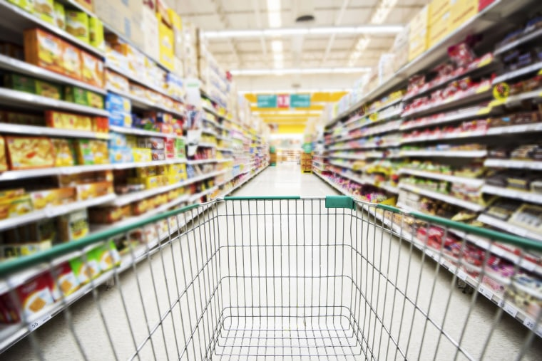
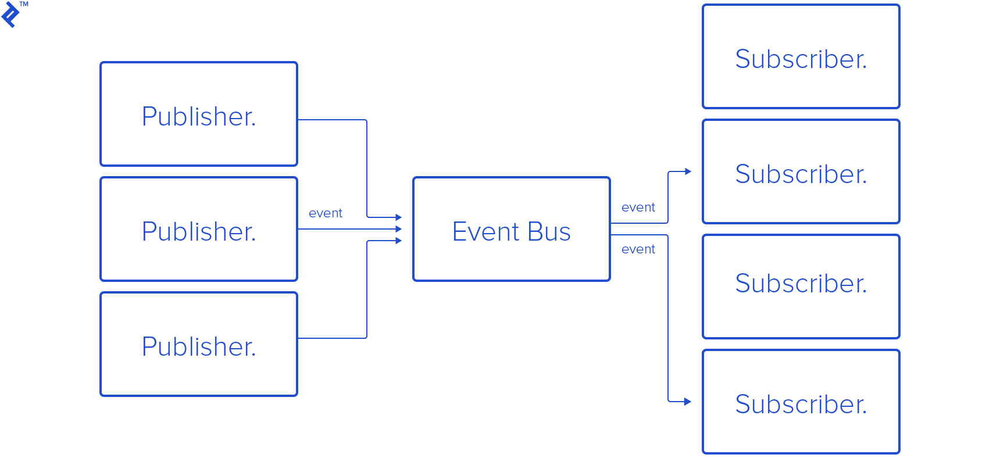

If you took your average American and dropped them in front of pretty much any supermarket in America with money and a shopping list, they would most likely be able to purchase most of, if not all of the things on that list without much difficulty (given that the items listed are actually present in the store). It could be a chain supermarket that they’ve never heard of before in a completely forigen part of the States, but they would most likely be able to navigate their way through. The question becomes, why is this possible? 

The answer is that most American supermarkets follow a design pattern that provides a template for how the store should be structured. There is usually an entrance with shopping carts or baskets that leads into a set of organized aisles that usually have overhead labels, and once all of the items have been gathered, the checkout is between the shopper and the exit. This design pattern has been found to be one of the most effective at getting shoppers to find what they need and purchase it in a reasonable amount of time with minimal issue. 

Just like a supermarket follows a known design pattern, coding while following a design pattern can help to ensure that the code is effective and understandable. Utilizing a non-standard pattern can cause confusion and difficulty while programming in the same way that having the shopping carts in the back of a store instead of the front would be difficult and irritating. These patterns are designed to be open-ended enough that you don’t feel restricted, but they still have guidelines to make sure you have a clear goal.

An example of a design pattern in coding would be the Publish-Subscribe pattern which I and many other developers have used when designing websites. This pattern allows data to be “published” to a list of “subscribers” that want the data. In terms of a website, this could be used for retrieving database entries to show to users. The database would publish the forward-facing data, and the UI would subscribe to that posting and be able to retrieve whatever data gets posted. This pattern is extremely useful because it decouples the processes of sending and retrieving data, so the sender and receiver never have to directly interact with each other. 

Going back to our supermarket analogy, the Publish-Subscribe pattern is like the cart collector and a shopper. The cart collector gets to gather the carts and make them available, and the customer can grab carts when necessary. Without this relationship, carts would be everywhere and you would have to track down a shopping cart first before you can use it. Luckily, design patterns make both shopping and programming a whole lot easier. 
