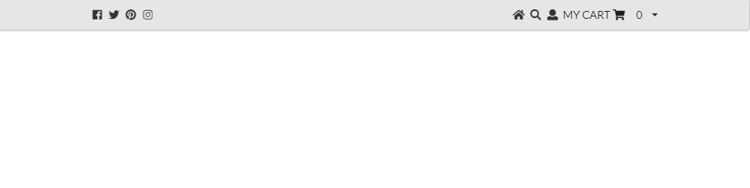

  HTML and CSS are unique in the programming world because they are *the* way to create a website from the ground up. If you wanted to create a script or a GUI, there are dozens of popular programming languages that could be used. However, when creating a website, HTML and CSS are the de-facto way to do so. This is both amazing, because you never have to learn a new language to put together a front-end, but also potentially terrible, because if you can't figure out how to make something look the way you want it to, there isn't really another language that you can turn to. This situation is where Frameworks come in to save the day.
    
  Most frameworks basically boil down to a pre-set stylesheet and a Javascript backend to make the magic happen. Instead of banging one's head against the wall, trying to get the margins of an image set to line up with a paired image perfectly, a framework with the desired formatting tool could be utilized. Even if you have a god-like understanding of HTML and CSS, using a framework like Semantic UI shortens the time needed to set up commonly used layouts such as headers and footers.  
    
As an example of the usefullness of frameworks, we will be recreating the following header using both Semantic UI and basic HTML/CSS:

Using just HTML and CSS, with no framework, we need to do the following:
HTML:
```
<div class="menu">
  <div class="left">
    
    
    
    
  </div>

  <div class="right">
    
    
    
    <p class="dropdown">
      MY CART 
      0 
    </p>
  </div>

</div>
```
And associated CSS:
```
.menu {
  background-color: #e6e6e6;
  overflow: hidden;
  border: none;
  box-shadow: none;
}

img {
  width: 17px;
  height: 17px;
  padding: 14px 16px;
  vertical-align: text-top;
}

p {
  color: black;
  font-size: 17px;
}

.dropdown {
  float: right;
}

.left {
  float: left;
}

.right {
  float: right;
}
```

Now using Semantic UI, we can shorten all of that down to just this, completely getting rid of the css file:
```
<div class="ui borderless menu" style="background-color: #e6e6e6">
  <div class="ui container">
    <div class="fitted item"><i class="facebook icon"></i></div>
    <div class="fitted item"><i class="twitter icon"></i></div>
    <div class="fitted item"><i class="pinterest icon"></i></div>
    <div class="fitted item"><i class="instagram icon"></i></div>

    <div class="fitted right item"><i class="home icon"></i></div>
    <div class="fitted item"><i class="search icon"></i></div>
    <div class="fitted item"><i class="user icon"></i></div>
    <div class="ui fitted item dropdown">
      <div class="text">MY CART <i class="shopping cart icon"></i> 0</div>
      <i class="dropdown icon"></i>
      <div class="menu">
        <div class="item">Your cart is currently empty.</div>
      </div>
    </div>
  </div>
</div>
```

At this point it is apparent that while the same goal can be achieved with or without a framework, using one can make the job much easier. Additionally, Frameworks are faster to implementent and are inheritly scalable, where a site made entierly without a framework may easily break if a new component is added.
