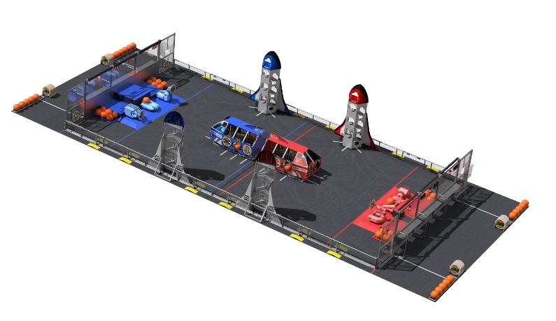

FIRST Robotics Competition(FRC) is a high-school level robotics competition where teams have 6 weeks to plan, design, build, and program a robot that can complete the challenge presented that year. In 2019, the challenge was called "Destination: Deep Space" and the game field is shown in the image below. The game had two major objectives, the first of which was to attach "Hatch Panels" (19in diameter polycarbonate discs) to the opening on the "Rockets" on the sides of the field, and on the "Cargo Bay" in the center. The second objective was to load the "Cargo" (13-in diameter rubber playground balls) into the Rocket and/or Cargo Bay after the Hatch Panels are mounted. Matches were 2 min, 30 seconds long, played with 6 robots, 3 on each side, with each side trying to score as many points as possible by completing objectives. Our team decided to build towards a "Support" role, placing as many Hatch Panels as fast as possible to allow our other two teammates to focus on scoring Cargo.

The code for the robot can be found [here](https://github.com/mililanirobotics/FRC2019/blob/master/PGFRC2019timedRobot/src/main/cpp/Robot.cpp).

