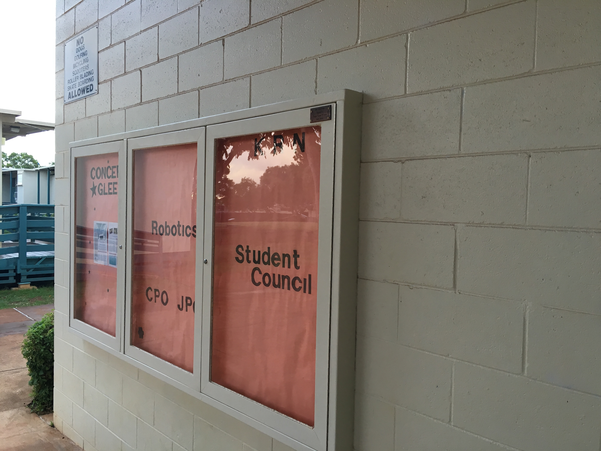

While not a programming project, or even a project involving much technology at all, my Eagle Scout project is one that is very important, and was very formative for me. To provide context, Eagle Scout is the highest rank attainable in the Boy Scouts of America, and to reach that rank, a service project must be proposed, approved, and completed. The project itself does not have many constraints, but the Scout needs to be able to show leadership throughout the planning and implementing of the project.

When planning my project, I knew that I wanted to give back to my elementary school, so I reached out to them if they had any issues that I could solve with my project. It turned out that they had issues with their bulletin boards being vandalized, and needed a way to prevent that from happening. My plan was to construct a case for the board(show above) that could lock to protect the board itself. I purchased the materials myself, got some assistance from a woodworker on the design of the case to make sure it would work nicely, and recruited other Scouts from my troop to help put everything together.

This project taught me a very important lesson about delegating work, and not trying to do everything by myself. Going into the project, I was a person who had the mindset of "If you want it done right, do it yourself." When it got to the point where we were actually constructing the case, I realized that doing everything myself would take forever, and I would never be able to get the project done in time. I began delegating work to my fellow Scouts, and when I put my trust in them, they were able to help me produce a product that I am still extremely proud of to this day.
