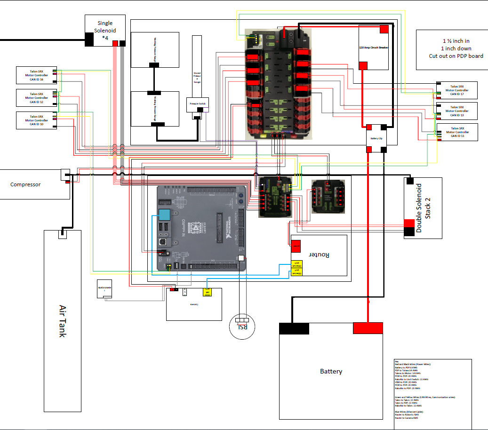

FIRST Robotics Competition(FRC) is a high-school level robotics competition where teams have 6 weeks to plan, design, build, and program a robot that can complete the challenge presented that year. In 2019, the challenge was called "Destination: Deep Space" and the game field is shown in the image below. The game had two major objectives, the first of which was to attach "Hatch Panels" (19in diameter polycarbonate discs) to the opening on the "Rockets" on the sides of the field, and on the "Cargo Bay" in the center. The second objective was to load the "Cargo" (13-in diameter rubber playground balls) into the Rocket and/or Cargo Bay after the Hatch Panels are mounted. Matches were 2 min, 30 seconds long, played with 6 robots, 3 on each side, with each side trying to score as many points as possible by completing objectives. Our team decided to build towards a "Support" role, placing as many Hatch Panels as fast as possible to allow our other two teammates to focus on scoring Cargo.

Our team consisted of about 20 members, and I was the leader of the Electrical/Programming Subteam. My team's job was to plan and wire the electronics(shown in the diagram below), as well as program the robot. I personally worked on the code that ran our Cargo and Hatch Panel delivery arm. It utilized the readings from a gyroscope to calculate the desired angle for the arm to pivot to. This meant that our drivers could press a single button on their controller to pivot to one of the 3 angles that we wanted, instead of having to fight to get to a good angle. I also assisted my team members with a camera tracking function that would automatically line our robot up to score a Hatch Panel with very good speed and accuracy.

This was my last year on my school's FIRST team, and as such it was a very important one to me. In previous years, we would set really lofty programming goals, and never be able to fully meet them due to the time constraints. For this competition, we set very realistic goals, met them, and then were able to surpass those goals by refining what we had. I learned that having realistic goals meant we could keep morale up by hitting our goals on time, which helped to keep people active on the team and excited to work. In previous years, we would have people that left the team because they felt nothing was getting accomplished because we were never hitting the goals we set. I've applied this principle to my solo projects, making sure to break them down into attainable goals that I can achieve and keep myself excited to work on the project. 

The code for the robot can be found [here](https://github.com/mililanirobotics/FRC2019/blob/master/PGFRC2019timedRobot/src/main/cpp/Robot.cpp).

