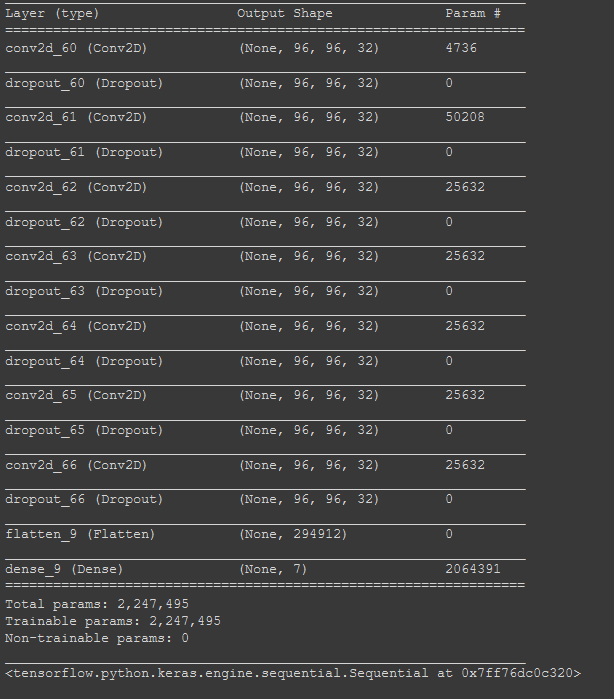

ICS 235 was an introductory machine learning course, and this project was the final program we made in the semester. The goal was to get the network to drive a race car around a randomly generated race track. The training data used was a set of recordings of completed tracks. All of the training was based solely on image recognition, as the possible inputs (left, right, gas, and break) were displayed on the training data. 

The process for getting this program to work was quite a long one, as every time I wanted to make even the smallest of changes to the training method, I would need to wait for it to retrain. The process of retraining consisted of me running the program, seeing what the network does when faced with a certain track layout, then trying to figure out what could be causing issues, or what type of layers would help the network learn better. An example of this was that when I only had a single layer of nodes, the car wouldn't drive whatsoever if it started on a straight, or would only drive in circles if it could see a turn. I reasoned that this was happening because the single layer of nodes was overfitting to the data, and had no clue how to recognize new tracks, and as such it would do nothing or just get stuck in a loop.

The most important thing that this project taught me was that working with others in parallel can be a really powerful tool. Since everyone had a similar end goal, and since the networks all took a while to train, we worked with each other on improving and troubleshooting each other's networks. If I had to work on this project completely alone, my racer would probably never have been able to drive as well as I got it to.

Google CoLab file can be found [here](https://drive.google.com/file/d/1AaNhgcUaKcjMv4nQx26L_rMpXYfGoClb/view?usp=sharing).
